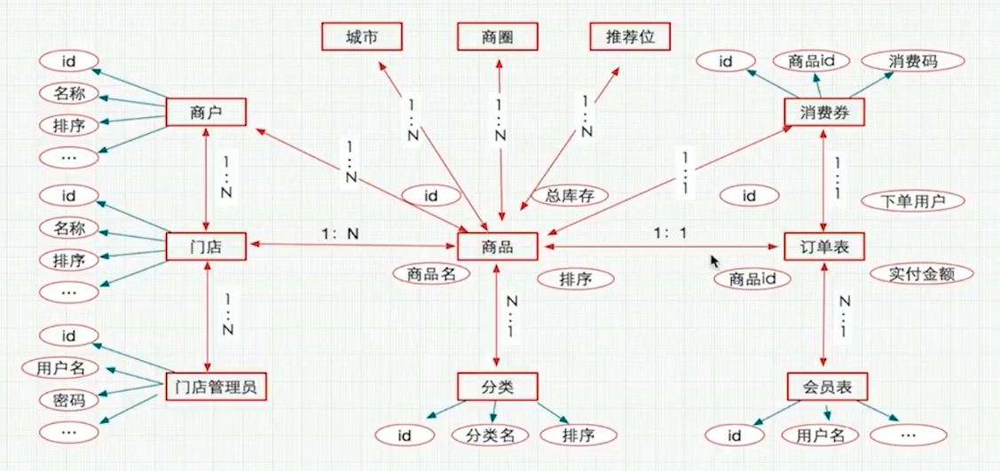

# Think-php-Group-buying
基于thinkphp5的团购网站

### 需求分析
- 系统模块
    - 商家平台
        - 商家入驻申请 
            - ajax应用
            - 更具地址获取经纬度
            - 图片上传
            - 邮件发送
        - 商家登录
            - session综合运用
        - 门店管理
            - 新增门店
            - 门店列表
            - 编辑门店
        - 商品管理
            - 添加商品
            - 商品列表            
    - 主平台
        - 分类管理
            - 添加分类
            - 分类列表
            - 分类排序
            - 修改状态
            - 修改分类
            - 删除分类
            - 获取子栏目
            - 分页处理
        - 城市管理
        - 商家管理
            - 商户入驻申请审批
            - 商户列表
        - 团购商品商品管理
            - 商家提交的商品列表
            - 商家提交的商品审批
            - 商品列表
            - 商品搜索
            - 分页 排序 修改状态
        - 推荐位管理
            - 增删改查
        - 会员管理
            - 增删改查
        - 订单管理
            - 增删改查
    - 前台模块
        - 首页
        - 商品列表页
        - 商品详情页
        - 订单确认页
        - 微信支付
        - 消费劵
        - 登录注册
- 表的设计
    - 表的创建
            
        